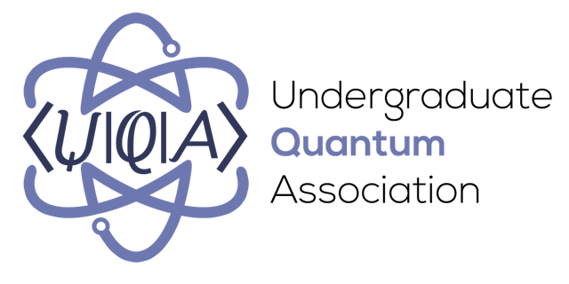

### Congratulations to our short-listed authors!
Below are the short-listed finalists for the 2023 Quantum Steampunk Short Story Contest. 
- *Entry1* by Author1
- *Entry2* by Author2

### Vote for a People's Choice Award winner!
Please vote for your favorite story in the People's Choice Award category! You can use the Google form by following [this link](https://forms.gle/bwKyE8F262EWRK699) or by entering your choices below.

<iframe src="https://docs.google.com/forms/d/e/1FAIpQLSfeOVsJDa27e7G90LrAtJfTGM8jcqNImrnl9ft7GHsObvxuwQ/viewform?embedded=true" width="640" height="895" frameborder="0" marginheight="0" marginwidth="0">Loading…</iframe>

### Rules

Each entry must…
1. be written in English;
2. contain no more than 3,000 words;
3. be written in a steampunk style—including, but not limited to, taking place during the 1800s (and, if desired, some time in the future); and
4. involve at least one real or imagined quantum technology.

Those are the main requirements. Common-sense details are in the [Contest Rules](./Contest_Rules.pdf).

### Stages

1. *Submission:* Oct. 10, 2022—Jan. 15, 2023, 11:59 PM EST, via [submission form](https://forms.gle/gr1ejeKDCBQPeBcbA).
2. *First cut:* Jan. 15, 2023—Mar. 15, 2023.  
The [leadership team](#leadership) will choose 15 finalists.

3. *Finalist judging:* Mar. 16, 2023—Apr. 16, 2023  
	The [judges](#judges) will select winners. The finalists will be posted online, where the public can vote for a People’s Choice Award winner.

4. *Announcement of winners:* May 1, 2023

### Prizes 

Multiple prizes will be awarded, in the form of Visa gift certificates. The grand prize will be $1,500; the rest of the prizes will be at least $100 each and will total $3,000. The leadership and judges will determine how many prizes and which denominations to award. We anticipate offering prizes for categories such as Most Badass Steampunk Hero/ine, People’s Choice, Best Student Submission, and Quantum Technology We’d Most Like to Have.

### How to enter 

Fill out and submit the [online form](https://forms.gle/gr1ejeKDCBQPeBcbA).

### Who can enter 

Everyone aged 13 and over. 

### Leadership 
- Nicole Yunger Halpern (nicoleyh@umd.edu)
- Jade LeSchack (leschack@terpmail.umd.edu)
- Hannah Cho (hkim821@terpmail.umd.edu)
- Undergraduate Quantum Association (shortlisting committee)

<!-- <iframe class="airtable-embed" src="https://airtable.com/embed/shrXmb9QweRXyZEx5?backgroundColor=teal" frameborder="0" onmousewheel="" width="100%" height="533" style="background: transparent; border: 1px solid #ccc;"></iframe> -->

<h2 id="judges" class="text-center"> Judges </h2>

    

      
      

        <h2>Jeffrey Bub</h2>
        <h3>Distinguished University Professor and philosopher of physics University of Maryland.</h3>
      

    

  

      
    

      <h2>Louisa Gilder</h2>
      <h3>Author of <i>The Age of Entanglement</i>.</h3>      
    

  

  

      
    

      <h2>Jack Harris</h2>
      <h3>Professor of Physics, Yale.</h3>      
    

  

  

      
    

      <h2>Walter E. Lawrence III</h2>
      <h3>Emeritus Professor of Physics, Dartmouth..</h3>      
    

  

  

      
    

      <h2>Ken Liu</h2>
      <h3>Speculative-fiction writer; Hugo, Nebula, and World Fantasy winner.</h3>      
    

  

  

      
    

      <h2>Spiros Michalakis</h2>
      <h3>Outreach Manager, Quantum Physicist, and Scientific Consultant for the <i>Ant-Man</i> films, Caltech.</h3>      
    

  

  

      
    

      <h2>Emily Brandchaft Mitchell</h2>
      <h3>Associate Professor of English and Novelist, University of Maryland.</h3>      
    

  

  

      
    

      <h2>Patrick R. Warfield</h2>
      <h3>Director of Arts for All,  College of Arts and Humanities, University of Maryland.</h3>      
    

  

