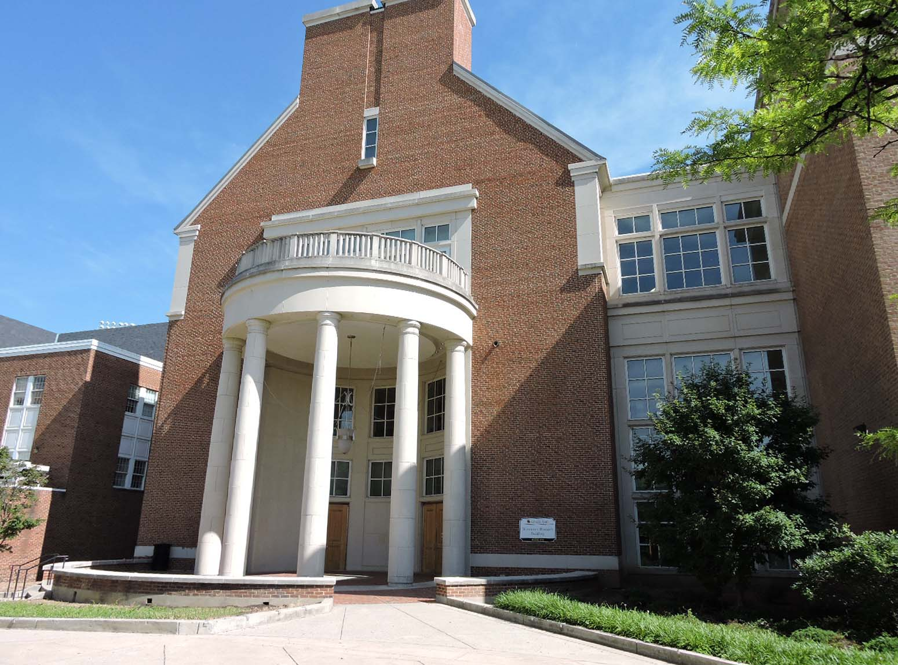
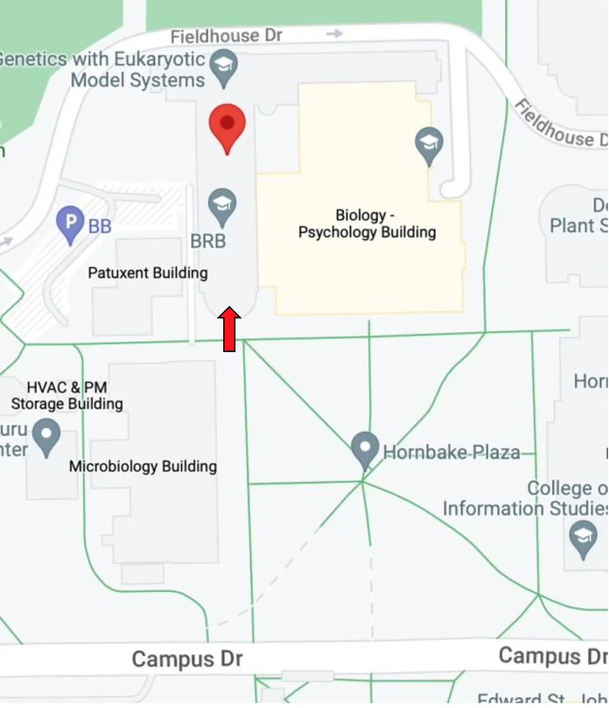

### Description

The Maryland Quantum-Thermodynamics Hub will hold its first symposium on Pi Day, 2023. This one-day event’s aim is to cover recent advances in quantum thermodynamics broadly while fostering new collaborations. The symposium will include four invited speakers, lightning talks, and ample time for discussions. The talks will also be streamed on Zoom.

### Conference Photo

<!-- ### Registration
Please fill out the [form](https://docs.google.com/forms/d/e/1FAIpQLSeDzA_GcMM28n5Nyd2vrmMG8YR3LeXPSsl_jTgEJWm9KnYC0w/viewform) to register for the symposium. Virtual attendance is possible.  -->

### Schedule

<table class="table table-bordered table-responsive">
  <thead class="thead" style="background-color: #704214;">
    <tr>
      <th style="width: 30%; color: #EAE7D6;">Time</th>
      <th style="color: #EAE7D6;">Event</th>
    </tr>
  </thead>
  <tbody>
    <tr style="background-color: #b9a56e;">
      <td>9:00 AM — 9:45 AM</td>
      <td>Cofee and Breakfast</td>
    </tr>
    <tr style="background-color: #ffc8a1;">
      <td>9:45 AM — 10:00 AM</td>
      <td>Welcome & Overview of Hub</td>
    </tr>
    <tr style="background-color: #ffc8a1;">
      <td>10:00 AM — 10:45 AM</td>
      <td><a href="https://physics.mit.edu/faculty/paola-cappellaro/">Paola Cappellaro</a>, MIT
        
      <a data-toggle="collapse" href="#Cappellaro" role="button" aria-expanded="false" aria-controls="Cappellaro">An Experimental Toolbox for Quantum Thermodynamics</a>
      

      Elucidating the laws of thermodynamics at their most fundamental level requires clarifying the thermodynamic properties of quantum systems, and especially the contributions of coherence and correlations in the concept of work and heat transfer. Quantum fluctuation relations have emerged as a powerful guide to understanding nonequilibrium quantum thermodynamic processes, but they are challenging to probe experimentally due to requirements of the measurement protocols and limited access to the environment.  In this talk I will show how we can use spins associated with the nitrogen-vacancy center in diamond as a novel toolbox for quantum thermodynamics, thanks to the good control and coherence time, as well as our ability to tailor the interaction with a dissipative environment. As an example, I will show how we can employ repeated optical interactions to engineer a tunable dissipative channel which embodies an autonomous feedback process (Maxwell’s demon). In turns, this allows to measure generalized energy fluctuations relations in a qutrit system.
      

      </td>
    </tr>
    <tr style="background-color: #b9a56e;">
      <td>10:45 AM — 11:00 AM</td>
      <td>Coffee Break</td>
    </tr>
    <tr style="background-color: #ffc8a1;">
      <td>11:00 AM — 11:45 AM</td>
      <td><a href="https://sites.chem.utoronto.ca/chemistry/dsegal/">Dvira Segal</a>, University of Toronto
        
      <a data-toggle="collapse" href="#Segal" role="button" aria-expanded="false" aria-controls="Segal">The Quantum Absorption Refrigerator as a Case Study in Quantum Thermodynamics</a>
      

      Rethinking the operation principles of thermal machines in the nanoscale and quantum domain, we focus on a continuous machine operating in steady state, the quantum absorption refrigerator, and examine three key questions: (i) What is the impact of coherences within the working fluid on the performance of the quantum machine? (ii) How does the strong system-bath interaction affect the device's operation?  (iii) What can we learn about the machine from current noise? To examine these topics, I will discuss open quantum system techniques, which we utilize and develop. I will then describe some results, focusing on principles. Finally, I will offer my perspective on the impact of research in theoretical quantum thermodynamics on related disciplines.
      

      </td>
    </tr>
    <tr style="background-color: #b9a56e;">
      <td>11:45 AM — 01:15 PM</td>
      <td>Group photo followed by lunch</td>
    </tr>
    <tr style="background-color: #ffc8a1;">
      <td>01:15 PM — 02:00 PM</td>
      <td><a href="https://raizenlab.ph.utexas.edu/">Mark Raizen</a>, UT Austin
        <a data-toggle="collapse" href="#Raizen" role="button" aria-expanded="false" aria-controls="Raizen"> Controlling and Cooling of Atoms using Photon Entropy</a>
      

      Production of quantum degenerate atomic gases relies on laser cooling and evaporative cooling.  The latter has been the limiting factor for the available flux of atom lasers due to the large loss of atoms and the long evaporation times.  Motivated by proposed fundamental tests of physics which require ultra-bright atom lasers, we developed a new approach to cooling atoms towards quantum degeneracy as an alternative to evaporative cooling.  Our method relies on a self-acting one-way wall for atoms that operates away from thermal equilibrium.  It uses the entropy of the photon, not its momentum, and realizes informational cooling at maximum efficiency.  The method was demonstrated experimentally, and new improvements will utilize high-angular momentum states to achieve very large phase-space compression.  Beyond cooling of atoms, a similar method is being used to efficiently separate isotopes for medicine at the non-profit Pointsman Foundation, www.pointsman.org.  This work illustrates the utility of controlling and sorting atoms to benefit humanity.
      

      </td>
    </tr>
    <tr style="background-color: #b9a56e;">
      <td>02:00 PM — 02:15 PM</td>
      <td>Coffee Break</td>
    </tr>
    <tr style="background-color: #ffc8a1;">
      <td>02:15 PM — 03:00 PM</td>
      <td><a href="https://www.preposterousuniverse.com/">Sean Carroll</a>, JHU
        <a data-toggle="collapse" href="#Carroll" role="button" aria-expanded="false" aria-controls="Carroll"> Philosophical Issues in Quantum Thermodynamics</a>
      

      Quantum mechanics and thermodynamics, individually, are two areas of physics where foundational issues loom large. It stands to reason that their overlap would raise particularly pressing questions, but that specific territory is largely unexplored. I will introduce the most important foundational ideas in both QM and thermo, discuss how they might be brought together, and speculate on connections to cosmology and other fields.
      

      </td>
    </tr>
    <tr style="background-color: #b9a56e;">
      <td>03:00 PM — 03:15 PM</td>
      <td>Coffee Break</td>
    </tr>
    <tr style="background-color: #ffc8a1;">
      <td>03:15 PM — 04:00 PM</td>
      <td>Lightning Talks</td>
    </tr>
    <tr style="background-color: #ffc8a1;">
      <td>04:00 PM — 06:00 PM</td>
      <td>Poster Session</td>
    </tr>
    <tr style="background-color: #b9a56e;">
      <td>06:00 PM </td>
      <td>End of Symposium</td>
    </tr>
  </tbody>
</table>

### Directions to the Symposium

The symposium will be held in Room 1103 of the [Biosciences Research Building](https://facilities.umd.edu/node/37298) (BRB) at the University of Maryland, College Park. The poster session will take place in the Atrium.

You can access the [campus map](https://maps.umd.edu/map/index.html?feature=building&name=413&basemap=detailed&hideiframe=true) and the [Google map](https://www.google.com/maps/place/Biosciences+Research+Building,+College+Park,+MD+20740/@38.989032,-76.9473592,17z/data=!3m1!4b1!4m6!3m5!1s0x89b7c6983db1236d:0xa59a6c3927bc68ed!8m2!3d38.9890321!4d-76.9431374!16s%2Fg%2F12hlfgm6n) to the building. On the Google map screenshot below, the red arrow indicates the BRB main entrance, shown in the photo, facing the NW corner of Hornbake Plaza. The red balloon marks the location of BRB 1103, where the talks will take place. Upon entering the building, go through the doors immediately to your right, then proceed through the long Atrium and up a small flight of steps to BRB 1103.

To print a PDF version of the directions, click [here](./directions.pdf).
