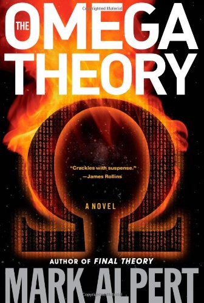

There is no registration fee, but registration is required.

{}

A collaboration between the [Maryland Quantum-Thermodynamics Hub](https://qtd-hub.umd.edu/) and the University of Rochester [Center for Coherence and Quantum Science](https://www.sas.rochester.edu/quantum/index.html) (CQS)

# Keynote Speaker
Novelist and Scientific American contributing editor [Mark Alpert](https://www.markalpert.com/), author of *Final Theory*, *The Omega Theory*, and other science-inspired novels.

# Invited Science Speakers

- [Felipe Barra](https://jfi.uchicago.edu/~tten/Chile/Sergio's%20site/fbarra.htm) (University of Chile)
- [Lea Ferreira dos Santos](https://physics.uconn.edu/person/lea-ferreira-dos-santos/) (University of Connecticut)
- [Saikat Guha](https://ece.umd.edu/clark/faculty/1891/Saikat-Guha) (University of Maryland)
- [Giulia Rubino](https://www.giulia-rubino.com/) (University of Bristol)
- Bayan Karimi (University of Chicago)
- [Charles Stafford](https://w3.physics.arizona.edu/people/charles-stafford) (University of Arizona)
- [Mark Wilde](https://www.engineering.cornell.edu/people/mark-wilde/) (Cornell University)

# Poster Session

A poster session will include a competition for student and postdoctoral entrants. [The Fidelity Center for Applied Technology](https://www.fcatalyst.com/) is offering prizes.

# Travel Scholarships

Early-career researchers will be able to apply for travel grants sponsored by [Normal Computing](https://www.normalcomputing.com/). Check back later for details.

<!-- ---
# Titles and Abstracts
---

## Jacob A. Barandes
*Harvard University*

### Statistical Mechanics with Stochastic Dynamics

There are a number of deep questions at the foundations of statistical mechanics, including the rigorous justification of its probability distributions, the limitations of ergodicity, the origins of the thermodynamic arrow of time, and the precise intertheoretic reduction of classical thermodynamics to quantum mechanics. In this talk, I will argue that a new approach to formulating quantum theory in terms of ‘indivisible’ stochastic dynamics may provide new resources for answering these questions, as well as for related problems, like making microphysical sense of causal influences. By employing this new indivisible formulation, I will also show how to use simple thermodynamic systems to build real-world analog models of quantum systems, like qubits.

---

## Ceren B. Dag
*Indiana University Bloomington*

### Quantum scarring in many-body quantum systems

Quantum scars, introduced within the context of single-particle billiard model in 1984, are quantum eigenstates with an enhanced probability density around an unstable periodic orbit (UPO) in a chaotic phase space. Recently, nonthermal many-body eigenstates embedded in an otherwise thermal spectrum have been identified as a many-body generalization of quantum scars. This concept, however, is not associated to a chaotic phase space, and hence the connection between the single- and many-body notions of quantum scars had remained incomplete. In this talk, I will present the first quantum many-body scars originating from UPOs of a chaotic phase space in different spin models. These states verify the eigenstate thermalization hypothesis, and we thus refer to them as thermal quantum many-body scars. While they do not preclude thermalization, their spectral structure featuring approximately equispaced towers of states yields an anomalous oscillatory dynamics preceding thermalization for wavepackets initialized on a UPO. I will highlight a particular spin-1 chain which hosts both types of scars, thermal and nonthermal where the latter is associated with stable periodic orbits. Time permitting, I will also provide evidence for the ubiquity of scarred quantum eigenstates in a generic spin-1/2 chain, and how scarring makes the system more likely to be found on an orbit it was initialized on, retaining a memory of its past. 

Physical Review Letters 132 (2), [020401](https://journals.aps.org/prl/abstract/10.1103/PhysRevLett.132.020401) (2024).  
Physical Review B 110 (14), [144302](https://journals.aps.org/prb/abstract/10.1103/PhysRevB.110.144302) (2024). 
arXiv:[2408.10301](https://arxiv.org/abs/2408.10301)

---

## Alaina Green
*University of Maryland*

### The Trapped Ion Toolkit for Quantum Thermodynamics

The precise control of quantized degrees of freedom available in trapped ion quantum computers/simulators have already been leveraged to perform seminal projects of experimental quantum thermodynamics (QTD). In this talk I will describe the standard trapped ion toolkit for quantum simulation - the contemporary ways in which both the ion's valence electronic state and the ions harmonic motion (i.e. phonons) are controlled in the lab. Additionally, I will present a short description of the early QTD experiments which used this toolkit and preview the means of expanding the toolkit, presently being pursued in my lab and others. Time allowing, I will briefly compare trapped ion simulators to other simulation platforms and/or comment on trapped ion quantum computers as tools for experimental QTD.

---

## Eduardo Martin-Martinez
*University of Waterloo*

### Towards Quantum Field Thermodynamics: Observational Entropy and Operational Definitions of Work and Heat

We will review the notions of internal energy and work distributions in quantum field theory (QFT), highlighting the limitations of extending standard thermodynamic definitions—many of them originally developed for finite-dimensional quantum systems—to the infinite-dimensional, local setting of QFT. Following this review, we will argue for a reformulation of thermodynamic concepts such as work, heat, and entropy within the algebraic framework of von Neumann algebras, which is the language that naturally encodes the operational and localization structure of QFT. This shift is essential for constructing a physically meaningful extension of quantum thermodynamics beyond finite systems, particularly in addressing the inadequacy of the von Neumann entropy to capture thermodynamic behavior in scenarios involving coarse-grained observations or limited resolution. Within this framework, we introduce a generalization of observational entropy for systems with a richer set of controllable degrees of freedom.

---

## Iman Marvian
*Duke University*

### Coherence Distillation, Fisher Information Metrics, and Energy-Conserving Quantum Circuits

In the first part of this talk, I will discuss the distillation of coherent states from multiple coherent thermal states under general phase-insensitive operations--protocols that combine several copies of noisy coherent states to obtain a single mode in a less noisy state, i.e., at a lower temperature. I will present the optimal protocol that yields the closest output to the desired coherent state and show that the error is governed by the so-called RLD Fisher information metric, thereby providing an operational interpretation of this quantity.

In the second part, I will discuss an ongoing project on energy-conserving quantum circuits, i.e., circuits that conserve the intrinsic Hamiltonian of qubits. I will explain how general energy-conserving unitary transformations can be implemented using energy-conserving interactions, such as the XY interaction, provided that one can employ a single ancillary qubit that acts as a catalyst.

---

## Niklas Muller
*University of New Mexico*

### From Quantum Scars to Advantage: Quantum Simulating Thermalization

---

## John Nichol
*University of Rochester*

### The thermodynamics of semiconductor quantum dots

Electrons in semiconductor quantum dots offer a versatile platform for exploring a wide variety of physical concepts, including thermodynamics. I will review the basic ideas of thermodynamics in the context of semiconductor quantum dots, provide an overview of recent results and open questions in this area, and discuss current experiments in my group in this area.

---

## Ricardo Román-Ancheyta
*Universidad Nacional Autónoma de México*

### Heat Transport and Rectification via Quantum Statistical and Coherence Asymmetries

The repeated system-bath interaction model, also known as the quantum collision model, remains a versatile framework for studying quantum heat transport phenomena. This approach allows us to identify the fundamental symmetries that govern these behaviors. I will illustrate this by discussing our recent work, in which we thoroughly investigated thermal rectification (asymmetric heat conduction) in scenarios similar to single atomic junctions, quantum thermal machines, quantum thermalization, and coherence generation in the steady state through composite interactions.

---
--> 

<!-- 

  <strong>🚧 More information to come soon. 🚧</strong>

  -->