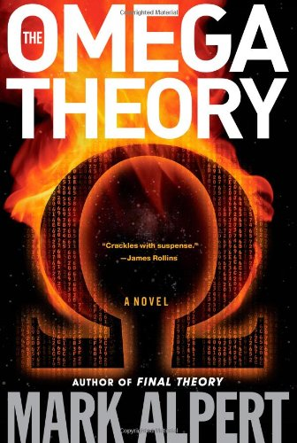

**Co-hosts:** [Maryland Quantum-Thermodynamics Hub](https://qtd-hub.umd.edu/) & University of Rochester [Center for Coherence and Quantum Science](https://www.sas.rochester.edu/quantum/index.html) (CQS)

There is no registration fee, but registration is required.

{}

## Accommodation

Participants of the QTD Conference can reserve rooms at a discounted group rate. Please use the following links to book your stay:

- [**Staybridge Suites Rochester University**](https://www.ihg.com/staybridge/hotels/us/en/find-hotels/select-roomrate?fromRedirect=true&qSrt=sBR&qSlH=ROCBA&qRms=1&qAdlt=1&qCiD=2&qCiMy=052026&qCoD=5&qCoMy=052026&qGrpCd=QTD&setPMCookies=true&qSHBrC=SB&qDest=1000%20Genesee%20Street,%20Rochester,%20NY,%20US&showApp=true&adjustMonth=false&srb_u=1&qRmFltr=)
- [**Hilton (UR Department of Physics Rate)**](https://www.hilton.com/en/attend-my-event/urdepartmentofphysics/)

# Keynote Speaker
Novelist and Scientific American contributing editor [Mark Alpert](https://www.markalpert.com/), author of *Final Theory*, *The Omega Theory*, and other science-inspired novels.

### Quantum Crash: Turning Science into Fiction and Vice Versa

Both fiction and physics require lots of imagination. Albert Einstein famously imagined chasing after a light beam, and his thought experiments about quantum entanglement paved the way for laboratory experiments several decades later. Meanwhile, novelists such as H.G. Wells and Arthur C. Clarke not only imagined science-based stories -- their fiction also suggested new directions for researchers to explore. Mark Alpert, a former editor at *Scientific American* who has written eleven science-based novels, will discuss how his education in physics inspired his first two novels, *Final Theory* and *The Omega Theory* (originally titled *Quantum Crash*). He’ll explain how a visit to a lab at the University of Maryland -- to help him edit a *Scientific American* story about quantum computing by Christopher Monroe and David Wineland -- led to the writing of *Quantum Crash*, which featured speculations on the connection between quantum physics and information theory. And he’ll talk about his continuing efforts to encourage collaboration between physicists and fiction writers, who have a mutual interest in stimulating new ideas for research and boosting the public’s interest in science.

# Invited Science Speakers

- [Felipe Barra](https://jfi.uchicago.edu/~tten/Chile/Sergio's%20site/fbarra.htm) (University of Chile)
- [Lea Ferreira dos Santos](https://physics.uconn.edu/person/lea-ferreira-dos-santos/) (University of Connecticut)
- [Saikat Guha](https://ece.umd.edu/clark/faculty/1891/Saikat-Guha) (University of Maryland)
- [Giulia Rubino](https://www.giulia-rubino.com/) (University of Bristol)
- Bayan Karimi (University of Chicago and Aalto University)
- [Charles Stafford](https://w3.physics.arizona.edu/people/charles-stafford) (University of Arizona)
- [Mark Wilde](https://www.engineering.cornell.edu/people/mark-wilde/) (Cornell University)

# Poster Session

A poster session will include a competition for student and postdoctoral entrants. [The Fidelity Center for Applied Technology](https://www.fcatalyst.com/) is offering prizes.

# Travel Scholarships

Early-career researchers will be able to apply for travel grants sponsored by [Normal Computing](https://www.normalcomputing.com/). Check back later for details.

---
# Titles and Abstracts
---

## Felipe Barra
*University of Chile*

### Decoherence and Information Flows in a Quantum Thermoelectric Maxwell Demon

We consider a multipartite system that operates as a thermoelectric engine and can be interpreted as an autonomous Maxwell demon rectifying particle flow against a chemical potential bias.
The standard dynamical description is the global Lindblad equation obtained from the Redfield equation after a full secular approximation. This equation satisfies a local detailed balance condition and is therefore thermodynamically consistent. Recently, Lindblad equations satisfying local detailed balance have also been derived using a partial secular approximation [1,2]. These local or semi-local Lindblad equations provide a more accurate description of the dynamics within their range of validity and, importantly, preserve coherences between nearly degenerate states in the nonequilibrium steady state.
We analyze particle, energy, and information flows [3]. Information flows are essential in multipartite systems to reconcile the second law with the apparent violations induced by the demon’s action. 
We focus on the partial secular regime, where the nonequilibrium steady state exhibits coherence, and introduce a dissipative particle transport mechanism whose strength can be tuned to drive a transition from a coherent to a coherence-free nonequilibrium steady state. We study how decoherence reshapes information flows and impacts the performance of the thermoelectric engine across this coherent–incoherent transition.

[1] A. Trushechkin, Unified Gorini-Kossakowski-Lindblad-Sudarshan quantum master equation beyond the secular approximation, Physical Review A <strong>103</strong>, <a href="https://journals.aps.org/pra/abstract/10.1103/PhysRevA.103.062226">062226</a> (2021).

[2] P. P. Potts, A. A. S. Kalaee, and A. Wacker, A thermodynamically consistent Markovian master equation beyond the secular approximation, New Journal of Physics <strong>23</strong>, <a href="https://iopscience.iop.org/article/10.1088/1367-2630/ac3b2f">123013</a> (2021).

[3] J. M. Horowitz and M. Esposito, Thermodynamics with continuous information flow, Physical Review X <strong>4</strong>, <a href="https://journals.aps.org/prx/abstract/10.1103/PhysRevX.4.031015">031015</a> (2014); K. Ptaszynski and M. Esposito, Thermodynamics of quantum information flows, Physical Review Letters <strong>122</strong>, <a href="https://journals.aps.org/prl/abstract/10.1103/PhysRevLett.122.150603">150603</a> (2019).

---

## Bayan Karimi
*University of Chicago* and *Aalto University*

### Coherent quantum thermodynamics in superconducting circuits

Coherence is a key property of quantum systems and plays a central role in quantum heat engines and refrigerators. In this talk, I will discuss two different experiments where decoherence and pure quantum dynamics play a role. The first one is related to thermalization in isolated quantum systems via the study of Poincare recoveries in a system of coupled qubits, where the revival time scales exponentially with the number of participating qubits: I present the theoretical background [1] and on-going experiments. The second example [2] is a thermal (bolometric) measurement [3] of quantum interference in a qubit-resonator system, weakly coupled to a heat bath. Landau-Zener type interferences are observed via the measurement of the temperature of the mesoscopic bath, when the system is driven periodically. This setup and measurement serve as a precursor experiment for a quantum Otto refrigerator.

[1] Bayan Karimi, Xuntao Wu, Andrew Cleland, and Jukka P. Pekola, <a href="https://arxiv.org/abs/2508.13489">arXiv:2508.13489</a> (2025).

[2] Christoforus Dimas Satrya, Aleksandr S. Strelnikov, Luca Magazzù, Yu-Cheng Chang, Rishabh Upadhyay, Joonas T. Peltonen, Bayan Karimi, and Jukka P. Pekola, <a href="https://arxiv.org/abs/2510.23092">arXiv:2510.23092</a> (2025).

[3] Jukka P. Pekola and Bayan Karimi, Rev. Mod. Phys. <strong>93</strong>, <a href="https://journals.aps.org/rmp/abstract/10.1103/RevModPhys.93.041001">041001</a> (2021).

---

## Lea Ferreira dos Santos
*University of Connecticut*

### Dissipation as a Resource: Coherence Recovery and Chaos Control

Dissipation is commonly regarded as an obstacle to quantum control, as it induces decoherence and irreversibility. In this talk, we show that dissipation can instead be exploited as a resource to engineer and regulate complex dynamics in interacting quantum systems. Using an experimentally realizable two-species Bose-Josephson junction, we demonstrate that dissipation enables distinct dynamical regimes, including synchronized phase-locked oscillations, transient chaos, and steady-state chaos. The emergence of each behavior is determined by experimentally tunable parameters. Remarkably, dissipation regulates the duration of chaotic behavior and information scrambling, and can restore coherence at long times.

---

## Mark Wilde
*Cornell University*

### Quantum thermodynamics and semi-definite optimization

In quantum thermodynamics, a system is described by a Hamiltonian and a list of non-commuting charges representing conserved quantities like particle number or electric charge, and an important goal is to determine the system's minimum energy in the presence of these conserved charges. In optimization theory, a semi-definite program (SDP) involves a linear objective function optimized over the cone of positive semi-definite operators intersected with an affine space. These problems arise from differing motivations in the physics and optimization communities and are phrased using very different terminology, yet they are essentially identical mathematically. By adopting Jaynes' mindset motivated by quantum thermodynamics, we observe that minimizing free energy in the aforementioned thermodynamics problem, instead of energy, leads to an elegant solution in terms of a dual chemical potential maximization problem that is concave in the chemical potential parameters. As such, one can employ standard (stochastic) gradient ascent methods to find the optimal values of these parameters, and these methods are guaranteed to converge quickly. At low temperature, the minimum free energy provides an excellent approximation for the minimum energy. We then show how this Jaynes-inspired gradient-ascent approach can be used in both first- and second-order classical and hybrid quantum-classical algorithms for minimizing energy, and equivalently, how it can be used for solving SDPs, with guarantees on the runtimes of the algorithms. Finally, we benchmark these algorithms on several problems of interest in thermodynamics, including one- and two-dimensional quantum Heisenberg models with nearest and next-to-nearest neighbor interactions and with the charges set to the total x, y, and z magnetizations. We also offer an alternative compelling interpretation of these algorithms as methods for designing ground and thermal states of controllable Hamiltonians.

Based on <a href="https://arxiv.org/abs/2505.04514">arXiv:2505.04514</a> and <a href="https://arxiv.org/abs/2508.09103">arXiv:2508.09103</a>.

---
