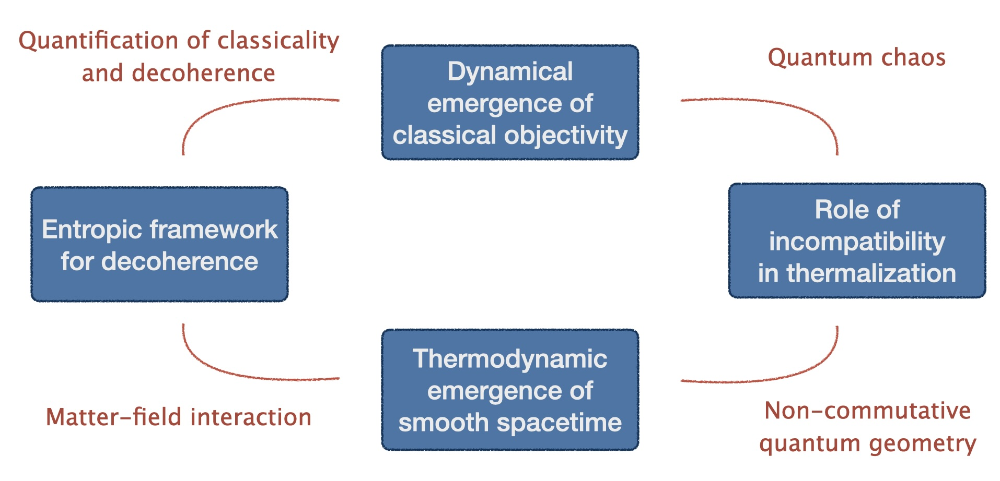

---
# Files in this folder represent a Widget Page
title: Research

banner:
  caption: '<a href="https://modvic.com">Bruce Rosenbaum</a> and Jim Su'
  image: 'Redo.jpg'

---

Several characteristics distinguish the everyday world modeled with Newtonian mechanics and classical electrodynamics. First, imagine classical observers who measure some observable $O$ of a quantum system prepared in a superposition of $O$ eigenstates. The observers obtain and agree about one outcome, instead of witnessing the superposition. Second, time flows in only one direction on the macroscale. Third, spacetime appears smooth, in contrast with the fluctuations expected at the Planck scale. How do these three properties arise from quantum mechanics? Quantum systems decohere, leaking information into their surroundings. The information spreads across many inaccessible degrees of freedom. The second law decrees this information dissipation. Hence thermodynamics helps explain how an objective classical reality arises.

Yet this simple story hides holes in the community's understanding. For instance, which interactions promote classicality's emergence, and which do not? How can quantum phenomena hinder thermalization and time's arrow? Over which time scales does classicality arise? Addressing such questions, we have been building a thermodynamic theory of classicality's emergence over the past three years. To our delight, this investigation revealed four incongruities that now require resolving:

1. **Non-Markovianity may oppose or enhance classical reality’s emergence:**  
   According to quantum Darwinism, classical objectivity emerges because information from a quantum system spreads across an environment. Information can flow backward from environments to systems. Different results indicate that such non-Markovianity hinders and enhances the emergency of objectivity. This dichotomy needs reconciling. Which information dynamics contribute to quantum Darwinism, and which to non-Markovianity?

2. **Decohering quantum systems parallel classical Brownian systems closely:**  
   A particle interacting with a quantized field offers a paradigmatic model for decoherence and thermalization. Here, a surprisingly tight relationship relates the position-decoherence rate to the classical momentum-diffusion rate. Why does decoherence couple so closely to thermalization? Can we construct a statistical description of decoherence, in terms of increasing entropy, generalizing beyond the model? Does decoherence have any uniquely quantum signatures?

3. **Noncommuting thermodynamic charges hinder some facets of thermalization but enhance others:**  
   A system thermalizes by exchanging quantities (*charges*), such as energy and particles, with an environment. Quantum charges can fail to commute with each other, bringing quantum uncertainty and measurement disturbance into thermodynamics. Charges' noncommutation hinders some facets of thermalization while enhancing others. How do we reconcile these opposing influences? Does one win out against the other?

4. **Smooth spacetime is conventionally expected to emerge from quantum gravity in the $\hbar$-to-0 limit, yet thermodynamics seems crucial:**  Quantum gravity governs the Planck scale, while spacetime looks smooth at the nanoscale. Thermodynamics interrelates vastly different scales, and general relativity has thermodynamic properties (e.g., Hawking radiation). Hence thermodynamics, beyond the $\hbar$-to-0 limit, should dictate how smooth spacetime emerges from quantum gravity. How?

We are resolving these puzzles using the framework of quantum thermodynamics. Thermodynamics is the study of heat, work, and temperature. The field germinated in the Industrial Revolution, which arose from the first widespread application of steam engines. Thermodynamics initially focused on engine efficiencies and other practicalities. Yet the field branched out to fundamental questions, such as why time has an arrow and how systems equilibrate. Thermodynamic concepts require rethinking in quantum contexts. For example, how to define quantum heat and work is unclear, as measuring a quantum system's energy disturbs the system and so can change the energy. How do thermodynamic laws extend to systems that can have quantum coherences and entanglement? Can entanglement and other quantum phenomena serve as resources in thermodynamic tasks such as work extraction? Over the past 15 years, *quantum thermodynamics* has become recognized as a field. Practitioners leverage the mathematical toolkit of quantum information theory, which characterizes quantum systems through how they store and process information.

<!-- 
Our research addresses fundamental issues in physics, including how classical reality and time’s arrow emerge from the counterintuitive laws of quantum mechanics. Quantum thermodynamics, a field focused on thermodynamic descriptions of individual quantum systems, provides a principled framework for studying the interactions between a quantum system and its thermal environment. The field’s tools and concepts have been used to elucidate fundamental physics such as far-from-equilibrium fluctuation relations, quantum resources theories, and the thermodynamics of quantum feedback control. We apply these tools and concepts to develop a distinctly thermodynamic perspective on the quantum-to- classical transition, and to illuminate deep connections between quantum coherence and the thermodynamic arrow of time.

**We aim to quantify how, thermodynamically, decoherence and the spread of information lead to emergent phenomena: classical objectivity and the flow of time.** We do so via three research thrusts:

**1. Developing a thermodynamic theory of quantum decoherence:**
Quantum decoherence strikingly resembles thermodynamic equilibration. Both processes arise from interactions and exchanges with the environment, and both introduce an effective arrow of time. We cast quantum decoherence and thermodynamic equilibration as two emergent aspects of the same underlying tendency: spontaneous evolution from a less likely to a more likely state. Guided by this notion, we are developing a unified theory of quantum decoherence and thermodynamic equilibration.

**2. Dynamical emergence of classical objectivity:** 
Objectivity is a matter of consensus achieved by independent observers. “Classical objectivity” is an emergent property explicable through every measurement’s interception of only a small fraction of the environment and all fractions’ carrying the same, classical information. This emergence of classical objectivity is known as quantum Darwinism. From a dynamical perspective, two questions arise: (i) Over which time scales does classical objectivity emerge from purely quantum dynamics? (ii) Over which time scales does equilibration overrule quantum Darwinism? We aim to answer these fundamental questions comprehensively.

**3. Quantifying the extent to which incompatible observables can hinder equilibration and so time’s arrow.** 
In conventional quantum statistical mechanics, a system and an environment exchange quantities —energy, particles, electric charges, etc.—represented by Hermitian operators that commute with each other. Yet noncommutation is a hallmark of quantum physics. Very recently, noncommuting exchanged quantities have begun spreading to condensed matter and atomic, molecular, and optical (AMO) physics. Exchanged quantities’ noncommutation was recently proposed to hinder thermalization. We aim to determine the conjecture’s accuracy quantitatively.

 -->
