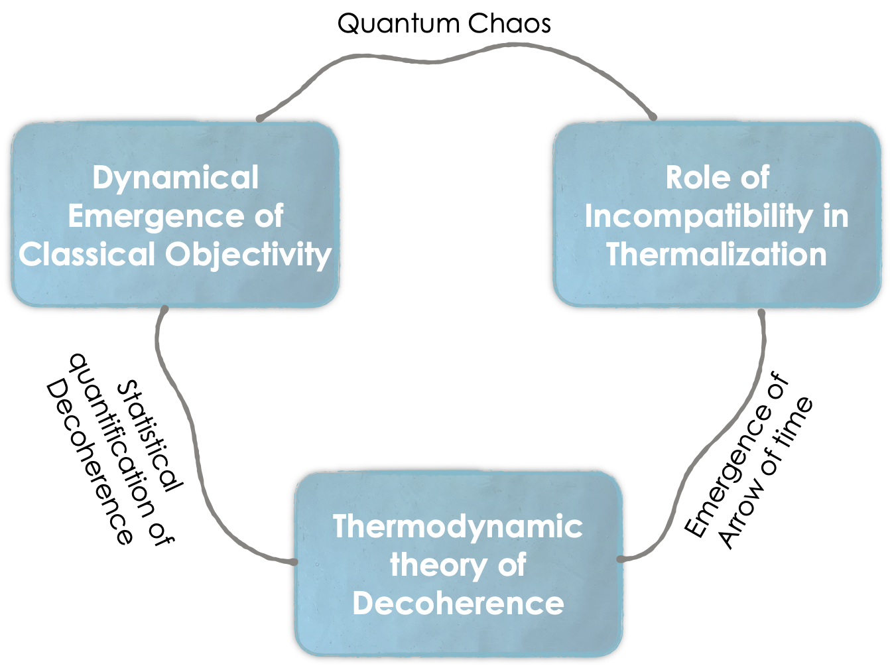
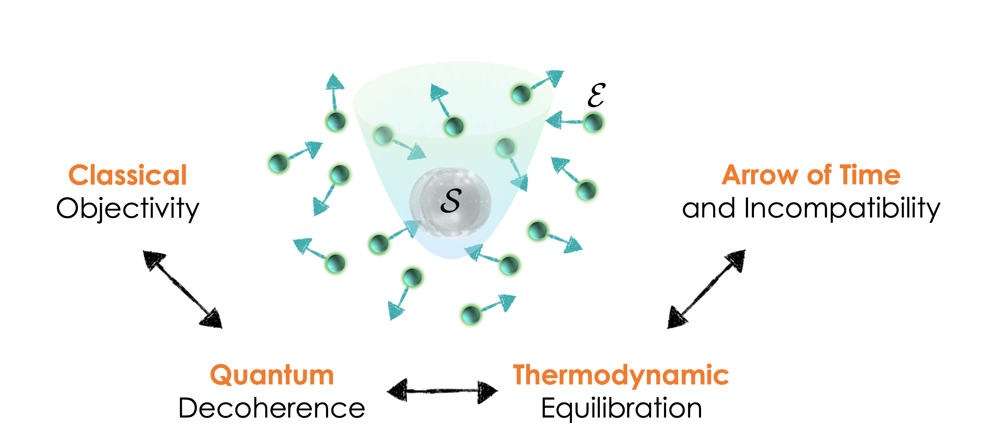

---
# Files in this folder represent a Widget Page
title: Research

---

Our research addresses fundamental issues in physics, including how classical reality and time’s arrow emerge from the counterintuitive laws of quantum mechanics. Quantum thermodynamics, a field focused on thermodynamic descriptions of individual quantum systems, provides a principled framework for studying the interactions between a quantum system and its thermal environment. The field’s tools and concepts have been used to elucidate fundamental physics such as far-from-equilibrium fluctuation relations, quantum resources theories, and the thermodynamics of quantum feedback control. We apply these tools and concepts to develop a distinctly thermodynamic perspective on the quantum-to- classical transition, and to illuminate deep connections between quantum coherence and the thermodynamic arrow of time.

**We aim to quantify how, thermodynamically, decoherence and the spread of information lead to emergent phenomena: classical objectivity and the flow of time.** We do so via three research thrusts:

**1. Developing a thermodynamic theory of quantum decoherence:**
Quantum decoherence strikingly resembles thermodynamic equilibration. Both processes arise from interactions and exchanges with the environment, and both introduce an effective arrow of time. We cast quantum decoherence and thermodynamic equilibration as two emergent aspects of the same underlying tendency: spontaneous evolution from a less likely to a more likely state. Guided by this notion, we are developing a unified theory of quantum decoherence and thermodynamic equilibration.

**2. Dynamical emergence of classical objectivity:** 
Objectivity is a matter of consensus achieved by independent observers. “Classical objectivity” is an emergent property explicable through every measurement’s interception of only a small fraction of the environment and all fractions’ carrying the same, classical information. This emergence of classical objectivity is known as quantum Darwinism. From a dynamical perspective, two questions arise: (i) Over which time scales does classical objectivity emerge from purely quantum dynamics? (ii) Over which time scales does equilibration overrule quantum Darwinism? We aim to answer these fundamental questions comprehensively.

**3. Quantifying the extent to which incompatible observables can hinder equilibration and so time’s arrow.** 
In conventional quantum statistical mechanics, a system and an environment exchange quantities —energy, particles, electric charges, etc.—represented by Hermitian operators that commute with each other. Yet noncommutation is a hallmark of quantum physics. Very recently, noncommuting exchanged quantities have begun spreading to condensed matter and atomic, molecular, and optical (AMO) physics. Exchanged quantities’ noncommutation was recently proposed to hinder thermalization. We aim to determine the conjecture’s accuracy quantitatively.

